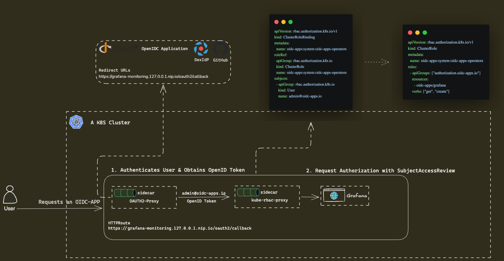

# oidc-apps

[](https://github.com/nickytd/oidc-apps/actions/workflows/build.yml)
[](https://github.com/nickytd/oidc-apps/actions/workflows/release.yml)
[](go.mod)
[](https://securityscorecards.dev/viewer/?uri=github.com/nickytd/oidc-apps)
[](LICENSE)
[](https://github.com/nickytd/oidc-apps)
[](https://pkg.go.dev/github.com/nickytd/oidc-apps)

## Usage

This controller enhances target deployments and statefulsets with side-car containers for performing OIDC authentication and Kubernetes RBAC authorization for incoming HTTP requests.

Usually applications such as `prometheus` or `grafana` do not offer any security mechanisms and delegate such responsibilities to cluster owners. This controller aims at providing a solution for bringing authentication [(oauth2-proxy)](https://github.com/oauth2-proxy/oauth2-proxy) and authorization [(kube-rbac-proxy)](https://github.com/brancz/kube-rbac-proxy)
layers in front of the targeted workloads, simplifying required configurations in a consistent way.

Targets for enhancement are identified by using labels and/or namespace selectors.
For example:

```yaml
# oidc-apps configuration
global:
  oauth2Proxy:
    scope: "openid email profile"
    clientId: "grafana"
    oidcIssuerUrl: "https://oidc.provider.com"
  domainName: "company.org"
  gateway:
    managed: true
    gatewayClassName: envoy
    httpRoutes:
      enabled: true
    listeners:
      - name: https
        protocol: HTTPS
        port: 443
        allowedRoutes:
          namespaces:
            from: All
        tls:
          mode: Terminate
          certificateRefs:
            - name: wildcard-tls

targets:
  - name: grafana
    namespaceSelector:
      matchLabels:
        kubernetes.io/metadata.name: monitoring
    labelSelector:
      matchLabels:
        app: grafana
    targetPort: 3000
    targetProtocol: http
    httpRoute:
      create: true
```



## RBAC Authorization

The kube-rbac-proxy sidecar performs a Kubernetes SubjectAccessReview for each
authenticated request using virtual resource attributes:

- **apiGroup:** `authorization.oidc-apps.io`
- **resource:** `oidc-apps`
- **subresource:** target name (e.g., `grafana`, `prometheus`)
- **verb:** `get`

Grant access by binding users or groups to a ClusterRole:

```yaml
apiVersion: rbac.authorization.k8s.io/v1
kind: ClusterRole
metadata:
  name: oidc-apps:system:oidc-apps-operators
rules:
  - apiGroups: ["authorization.oidc-apps.io"]
    resources:
      - oidc-apps/grafana
      - oidc-apps/prometheus
    verbs: ["get", "create"]
```

See [example/oidc-apps-rbac.yaml](example/oidc-apps-rbac.yaml) for a complete example.

## Kind Demo

A fully automated local demo using Kind, Dex, and Envoy Gateway is available:

```bash
cd example/kind-setup
./setup.sh
```

See [example/kind-setup/README.md](example/kind-setup/README.md) for details.

## External Dependencies

- [oauth2-proxy](https://github.com/oauth2-proxy/oauth2-proxy)
- [kube-rbac-proxy](https://github.com/brancz/kube-rbac-proxy)

## Release Process

Releases are driven by the [`Release`](.github/workflows/release.yml) workflow,
triggered by a push that changes [`VERSION`](VERSION) on `main` (or by manual
dispatch). To cut a new release:

1. Bump [`VERSION`](VERSION) to the next semver tag on `main`.
2. The workflow then, in order:
   - bumps `appVersion` in [charts/oidc-apps/Chart.yaml](charts/oidc-apps/Chart.yaml)
     and pushes the bump commit;
   - packages and pushes the Helm chart as an OCI artifact to
     `oci://ghcr.io/nickytd/oidc-apps/charts`;
   - builds & pushes multi-arch (`amd64` + `arm64`) container images for both
     `oidc-apps` and `kube-rbac-proxy` to `ghcr.io/nickytd/oidc-apps/`;
   - creates the `vX.Y.Z` git tag and a GitHub Release with auto-generated
     notes.

The chart `version` (the chart-shape version, distinct from `appVersion`) is
bumped manually in a separate PR when chart values change.

## Feedback and Support

Feedback and contributions are always welcome!

Please report bugs or suggestions as [GitHub issues](https://github.com/nickytd/oidc-apps/issues)
