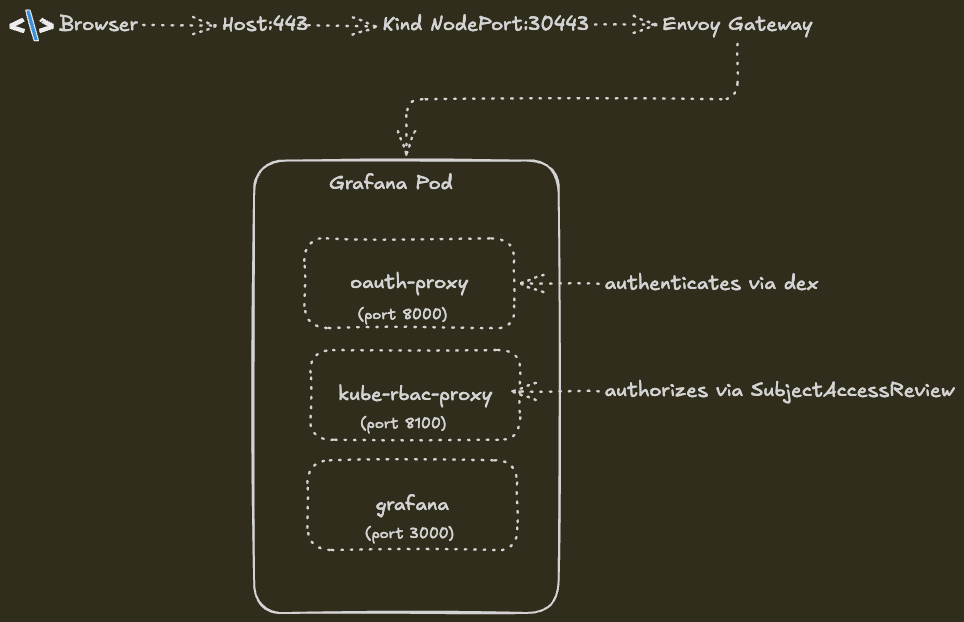

# Kind Demo: oidc-apps with Dex and Grafana

This example demonstrates the oidc-apps controller protecting a Grafana instance
using [Dex](https://dexidp.io/) as the OIDC identity provider and
[Envoy Gateway](https://gateway.envoyproxy.io/) (Gateway API) for ingress.

## Architecture



The controller injects oauth2-proxy and kube-rbac-proxy sidecars into the Grafana
pod via mutating webhook. An HTTPRoute is automatically created to route traffic
from the gateway to the oauth2-proxy sidecar.

## Prerequisites

- [kind](https://kind.sigs.k8s.io/)
- [kubectl](https://kubernetes.io/docs/tasks/tools/)
- [helm](https://helm.sh/)
- [Docker](https://docs.docker.com/get-docker/)
- [openssl](https://www.openssl.org/)

## Quick Start

```bash
./setup.sh
```

This builds the images, creates the Kind cluster, and deploys all components.
Once complete, access Grafana at:

```
https://grafana-monitoring.127.0.0.1.nip.io
```

Login credentials:
- **Email:** `user@oidc-apps.io`
- **Password:** `<check dex config>`

## What the Setup Does

1. Creates a Kind cluster with a port mapping (host:443 → container:30443)
2. Builds and loads the controller and kube-rbac-proxy images
3. Installs Envoy Gateway (provides Gateway API CRDs and data plane)
4. Deploys Dex (OIDC provider) and Grafana
5. Creates a self-signed wildcard TLS certificate for `*.127.0.0.1.nip.io`
6. Configures a Gateway with HTTPS listener and an HTTPRoute for Dex
7. Patches the gateway service to use NodePort 30443
8. Patches CoreDNS so in-cluster pods resolve `*.127.0.0.1.nip.io` to the
   gateway ClusterIP (required for oauth2-proxy ↔ Dex communication)
9. Installs the oidc-apps controller with the OIDC CA bundle
10. Applies RBAC (SubjectAccessReview permissions + user authorization)
11. Restarts Grafana to trigger sidecar injection

## Files

| File                   | Description                                          |
|------------------------|------------------------------------------------------|
| `setup.sh`             | Automated setup script                               |
| `kind-config.yaml`     | Kind cluster configuration with port mapping         |
| `dex.yaml`             | Dex deployment, config, and service                  |
| `grafana.yaml`         | Grafana deployment, service account, and service     |
| `gateway.yaml`         | GatewayClass, Gateway, and Dex HTTPRoute             |
| `oidc-apps-config.yaml`| oidc-apps controller Helm values (targets, OIDC config) |
| `rbac.yaml`            | RBAC for SubjectAccessReview and user authorization  |

## RBAC Model

The kube-rbac-proxy sidecar performs a SubjectAccessReview for each authenticated
request. The authorization check uses:

- **apiGroup:** `authorization.oidc-apps.io`
- **resource:** `oidc-apps`
- **subresource:** target name (e.g., `grafana`)
- **verb:** `get`
- **namespace:** target namespace

The example grants access to `user@oidc-apps.io` via a ClusterRoleBinding. In
production, bind to a group claim from your OIDC provider instead.

## Cleanup

```bash
kind delete cluster --name oidc-apps
```
